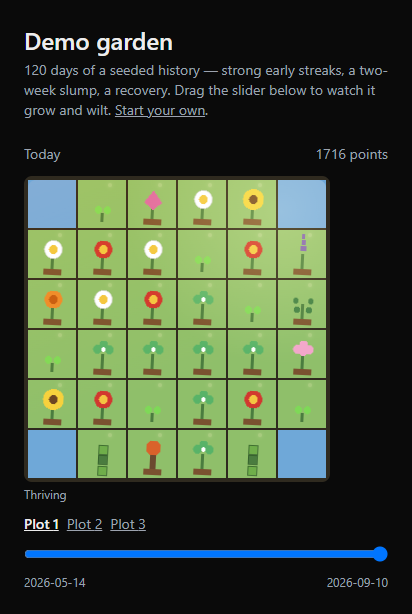

# Habit Garden

[](https://github.com/jasondhaki/VirtualGardenHabitTracker/actions/workflows/ci.yml)

A habit tracker where completed habits grow a shared pixel-art garden. Every plant reflects real completion history — nothing in the garden is placed by hand.


<!-- TODO: replace with a GIF of the /garden timeline scrubber in motion (drag through 90 days, watch the garden grow and wilt) — the image above is a static frame -->

The `/demo` route (statically generated, no auth, no database) shows a seeded 120-day history with a strong start, a two-week slump, and a recovery — the arc the whole app is designed around.

## How it works

Growth is a pure function of your completion log: check off a habit, and exactly one row gets written. Nothing about the garden — growth stage, streaks, wilt state — is ever stored or mutated directly; it's all recomputed from `Completion` and `DayRollup` rows on every read. The only things written once and left alone are *where* a tile sits and *which* species it is, assigned the moment a tile unlocks. That single rule is what makes the timeline scrubber below almost free, and what keeps the garden from ever silently drifting out of sync with your actual history.

## Timezone correctness

The most common bug class in habit trackers is date handling, so it gets treated as a first-class concern rather than an afterthought:

- "Today" is always resolved server-side, in the user's stored IANA timezone, via `date-fns-tz` — never `new Date().toISOString()` on the client.
- `Completion.localDate` and `DayRollup.localDate` are Postgres `DATE` columns, not timestamps, so a day boundary can't drift across environments.
- Streaks are schedule-aware: a Mon/Wed/Fri habit doesn't break on Tuesday, because the streak query filters to scheduled days before counting consecutive ones. Two grace days per calendar month are consumed silently.
- There's no cron job. Vercel's Hobby tier caps cron at two jobs a day, so rollups, streak recomputation, and achievement evaluation all backfill lazily the moment a user's data is next read — a user returning after three weeks gets three weeks of rollups written in milliseconds, computed per-user in their own timezone.

## Placement algorithm

The garden fills itself — there's no drag-and-drop UI. At signup, each user gets a `gardenSeed`, which feeds a `mulberry32` PRNG (`lib/prng.ts`) to generate a spiral-outward tile ordering unique to that garden. A tile at position *n* in that order unlocks once the user crosses points threshold *n*, so growth radiates outward from the center and an existing plant never moves once placed. Five tiles per plot are marked as feature slots reserved for rare and legendary species earned through hidden achievements, so the tracker's rarest rewards are never buried in a corner. Same seed plus same completion history always produces the identical garden — this is covered by property tests.

## Testing

```bash
pnpm test
```

The streak, rollup, and placement logic is the least visually obvious code to break and the most load-bearing, so it carries the heaviest test coverage in the repo:

- Month/year boundaries, DST spring-forward and fall-back, and a user changing timezone mid-streak
- Schedule-aware streaks (the Mon/Wed/Fri-doesn't-break-on-Tuesday case) and grace-day consumption
- A full rollup recompute from `Completion` reproducing the stored `DayRollup` exactly
- Achievement re-evaluation after recompute being idempotent
- Placement determinism: same seed + same history → identical garden, always; different seeds → different layouts

## Stack

| Layer | Choice |
|---|---|
| Framework | Next.js 15 (App Router) + TypeScript |
| Database | PostgreSQL on [Neon](https://neon.tech) |
| ORM | Prisma |
| Auth | Auth.js v5 (GitHub + Google OAuth) |
| Styling | Tailwind v4 |
| Dates | `date-fns` + `date-fns-tz` |
| Tests | Vitest |
| Hosting | Vercel Hobby |

Full design rationale — growth math, unlock curves, wilt tiers, the free-tier constraints that shaped every one of the above choices — lives in [`habit-garden-build-plan.md`](./habit-garden-build-plan.md).

## Running locally

```bash
pnpm install
cp .env.example .env   # fill in DATABASE_URL, AUTH_SECRET, and OAuth credentials
pnpm db:migrate
pnpm db:seed            # species catalog
pnpm db:seed:demo       # optional: a 120-day demo garden
pnpm dev
```

Other useful commands:

```bash
pnpm test         # vitest run
pnpm typecheck     # tsc --noEmit
pnpm lint          # eslint
pnpm db:studio     # prisma studio
```

## Credits

The garden's sprite sheet (`public/sprites/plants.svg`) is original artwork drawn for this project — not from a third-party asset pack.
